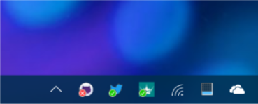

#  neticon

サーバーの稼働状態を Windows のタスクバーの通知領域上のアイコンで監視する為のツールです。


## 使用方法

下のような感じで引数を与えてください。ポート番号を省略すると ping(icmp) による確認となり、監視間隔を省略すると60秒単位となります。(全て省略すると usage が表示されます。)

```cmd
neticon.exe [リモートホスト名[:ポート番号][@監視間隔(秒単位)] [アイコンファイル名 [アイコンインデックス値]]]
```

Windows のログイン時に自動的に起動するような仕組みは作ってないので必要に応じて [ファイル名を指定して実行] ( [田]+[R] ) から `shell:startup` を開いてショートカットを登録してください。

### 使用例

```cmd
neticon.exe github.com
```

60秒ごとに github.com を ping で生死確認。通知領域のアイコンには default のモノを使用。

```cmd
neticon.exe twitter.com:443@90 twitter.ico
```

90秒ごとに twitter.com の 443 番ポートにアクセスして生死確認。通知領域のアイコンには twitter.ico を使用(※)。

※ default 以外のアイコンを使用する場合は自前でアイコンファイルを用意するなり shell32.dll, imageres.dll あたりのヤツを参照するなりしてください。

## ビルド方法

### 前準備

#### [Visual Studio](https://www.visualstudio.com/)

Visual Studio のインストールは C++ コンパイラと Windows SDK が含まれるようにしてください。
Visual Studio 2017 より新しい Visual Studio や通常と異なるパスにインストールした場合などは `.\source\solomon\conf\config.%COMPUTERNAME%.cmd` を作成し

```cmd
@SET VCVARSALL_PATH=C:\Program Files\Microsoft Visual Studio\2017\Community\VC\Auxiliary\Build\vcvarsall.bat
```

といった感じで vcvarsall.bat のパスを指定してください。

> 非推奨となりますが、その他の C++ コンパイラでもビルドすることは可能です。 Borland C++ Compiler でのビルドは[こちら](#solomon-を使わない-borland-c-compiler-でのビルド非推奨)を参照してください。 gcc あたりでのビルドもやろうと思えばできると思いますが、コンパイラオプション等々はご自身で調べてください。

#### [solomon](https://github.com/wraith13/solomon)

solomon についてはこのプロジェクトのローカルコピーのパスが `C:\github\wraith13\neticon` である場合に  `C:\github\wraith13\solomon` のように隣にローカルコピーを用意する分には設定の必要はありませんがそれ以外のパスに用意した場合は `.\source\solomon\conf\config.%COMPUTERNAME%.cmd` を作成し

```cmd
@SET SOLOMON_MAIN_CMD=C:\github\wraith13\solomon\cmd\main.cmd
```

といった感じで solomon の main.cmd のパスを指定してください。

> 非推奨となりますが、 solomon がなくともビルドすることは可能です。詳細は[こちら](#solomon-を使わない-vc-でのビルド非推奨)を参照してください。

### ビルドの実行

コマンド プロンプトから次の cmd を実行します。

```cmd
.\source\solomon\build.cmd
```

正常にビルドが完了すれば コマンド プロンプト の文字が緑色になり `.\snapshot\result\` にビルドされたバイナリがビルドのタイプ別に出力されます。

> この cmd に限らずこのプロジェクトの cmd の実行は削除対象となるディレクトリなどを除けば基本的にどのカレントディレクトリからの実行でも構いません。

次の cmd を実行しておくと `.\source\` ディレクトリ下の変更を検知しファイルが更新される度に自動的にビルドが実行されます。

```cmd
.\source\solomon\auto.build.cmd
```

### リリース用パッケージの作成

事前にビルドを行った上で、コマンド プロンプトから次の cmd を実行すると `.\release\` ディレクトリにリリース用パッケージが作成されます。

```cmd
.\make.release.package.cmd
```

### solomon を使わない VC でのビルド(非推奨)

最初に `.\source\solomon\build\subcmd\build.cmd` の内容を次のように書き換えます。

```cmd
@REM
@REM build
@REM

@SETLOCAL
@CALL "%CALL_VCVARSALL_CMD%" %VCVARSALL_ARG% >NUL

@REM リソースコンパイル
rc %NETICON_MACRO% .\neticon.rc

@REM 通常コンパイル
cl ".\neticon.cpp" %VC_CL_ARG% %NETICON_MACRO% /EHsc /MP /W4 /Feneticon.exe /link %VCLINKER_ARG% neticon.res

@ENDLOCAL
```

上の書き換えが済んだ上で、次のいずれかの cmd を実行してください。

```cmd
".\source\solomon\build\debug x86 ansi.cmd"
```

```cmd
".\source\solomon\build\release x64 unicode.cmd"
```

```cmd
".\source\solomon\build\release x86 unicode.cmd"
```

ビルドに成功すると `.\source\neticon.exe` が作成されます。

> 必要応じて `.\source\solomon\build\subcmd\increment.version.cmd` を実行するか、あるいは手作業で `VERSION.cmd` 内のビルド番号をインクリメントしてください。 solomon でのビルジ時は全てのビルドに成功すると自動的に `.\source\solomon\build\subcmd\increment.version.cmd` が呼び出されます。

### solomon を使わない Borland C++ Compiler でのビルド(非推奨)

`.\source\BUILD.h` の内容を次のように書き換えます。( BUILD の定義は区別がつけば基本的になんでも構いません。 )

```c++
#define BUILD Borland Build
```

`.\source\VERSION.h` の内容を手業で編集しバージョン情報を設定してください。

以上の前準備が済めば次のコマンドでビルドできます。( Borland C++ Compiler のパス設定やライブラリパス等々の設定が済んでる前提 )

```cmd
bcc32 -tWM -O1 -c neticon.cpp
brcc32 neticon.rc
ilink32 -aa neticon.obj, neticon.exe, , c0w32.obj import32.lib cw32mt.lib, , neticon.res
```

## ファイル/ディレクトリ構成

### .\readme.md

このファイルです。

### .\LICENSE_1_0.txt

このソフトウェアで採用しているライセンス

### .\make.release.package.cmd

リリース用パッケージ作成バッチです。
このバッチが行うのはリリース用パッケージの作成のみであり、事前に別途ビルドが実行されている必要があります。

### .\release\

リリース用パッケージ作成バッチによって作成されるリリース用パッケージが格納されるディレクトリです。

### .\snapshot\

solomon によって作成されるディレクトリです。

### .\snapshot\master\

solomon がビルド時に .\source\ ディレクトリをミラーしたディレクトリです。
.\testsnap\ ディレクトリへは .\source\ から直接ミラーされるのではなく、こちらのディレクトリから間接的にミラーされます。
こうすることでビルド中にソースコードを変更されてもソースコードとそのビルド結果の組み合わせがブレることがないようにしています。

### .\snapshot\result\

solomon によって作成されたビルドされた結果のファイルが格納されるディレクトリです。

### .\snapshot\misssed.compile\

solomon でのビルドに失敗した時のソースディレクトリがこちらに保存されます。

> 全保存されるので必要に応じて古いヤツは削除してください。

### .\snapshot\passed.compile\

solomon でのビルドに成功した時のソースディレクトリがこちらに保存されます。

> 全保存されるので必要に応じて古いヤツは削除してください。

### .\snapshot\solomon.data\

solomon が前回の実行結果を保存しておく為のディレクトリです。

### .\source\

ソースディレクトリです。
基本的にビルドに必要な全てのファイルはこのディレクトリに含まれ、また同時にビルドに不要なファイルは含みません。

### .\source\resource\

リソース関連のディレクトリです。

### .\source\solomon\

solomon 関連のディレクトリです。

### .\source\solomon\build.cmd

ビルドを実行するバッチファイルです。このコマンドの実行には solomon が必要になります。

### .\source\VERSION.cmd

次回ビルド時に .\source\VERSION.h に展開されるバージョン番号が格納されるバッチファイルです。ビルドが成功する度に自動的にビルド番号がインクリメントされます。メジャーバージョン及びマイナーバージョンについては通常手作業でこのファイルを編集することで設定します。

> 次回ビルド用のバージョン情報となる為、ビルドのプロセスが一通り終わった段階では最新ビルドよりビルド番号が一つ進んだ状態になります。

### .\testsnap\

solomon がビルドを行う時に実際に対象のビルドを実行するディレクトリです。

## ライセンス

Boost Software License - Version 1.0 を採用しています。
詳細は [.\LICENSE_1_0.txt](./LICENSE_1_0.txt) を参照してください。

日本語参考訳: http://hamigaki.sourceforge.jp/doc/html/license.html

## バージョン採番ルール

### バージョン表記のフォーマット

`A.BB.CCC`

### メジャーバージョン番号(`A`)

明らかな非互換の変更が行われた際にインクリメント。
桁数は不定。

### マイナーバージョン番号(`BB`)

機能追加や上位互換と判断できる仕様変更が行われた際にインクリメント。
桁数は2桁固定。

### ビルド番号(`CCC`)

バグフィックスや仕様変更というほどでもない微細な修正が行われた際にインクリ
メント。
桁数は3桁固定。

### 細則

* 各番号は0始まりとする。
* 固定桁に足りない場合は先頭を0埋めする。
* 番号が固定桁で足りなくなった場合は、上位の番号をインクリメントする。
* 上位の番号がインクリメントされた場合、下位の番号は0にリセットする。
